### 인트로
---
이전 포스팅에서 Git Bash로 리눅스, 유닉스 스타일 터미널을 맛 보는 방법을 알려줬다.

하지만 아직 부족하다.<br>
밋밋한 화면 보다 이게 지금 프로젝트 폴더인지, 브랜치 상태는 어떤지 한 눈에 확인하면 편하지 않을까?

Starship Prompt 가 그 해결법으로 VSCode Docs 의 [Terminal Apperance](https://code.visualstudio.com/docs/terminal/appearance) 문서에서 예시로 다루는 것을 보고 본인도 적용해서 사용해보니 편리하며 보기에도 깔끔하더라는 이야기.

<br>

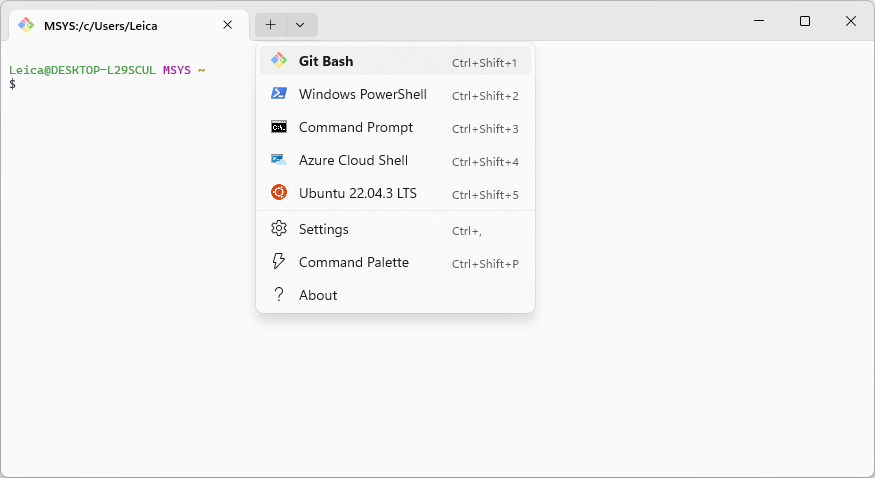
<center>밋밋한 Git Bash</center>

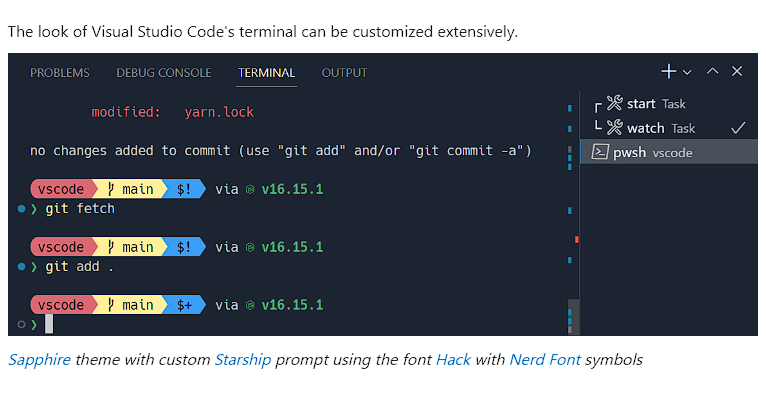
<center></center>
<center>Terminal Apperance 문서의 커스텀 예시</center>

<br>

### Prompt란?
---
`Shell`이 무엇인지 먼저 간단하게 알아보자.<br>
Git Bash 를 Shell 이라 부르며 우리는 이 것을 통해 시스템에 명령을 내린다.

Shell 은 시스템과 대화하기 위한 `대화수단, 인터페이스`인 것이다.<br>
명령어 시스템에서 `Prompt`란 명령어 입력 위치를 알려주는 `텍스트 혹은 신호`이다.
( 예: username@machine:$ )

우리가 명령어를 입력하면 그 앞에 '여기다 입력하세요.' 라며 추가적인 정보를 제공하는 것.

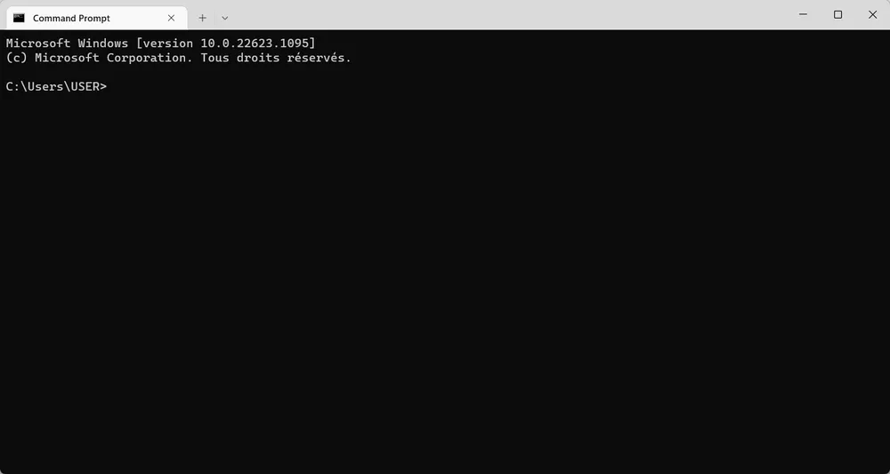

<br>

### Starship Prompt 설치
---

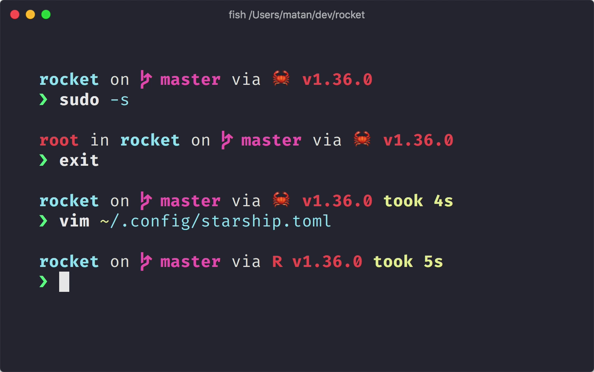

<br>

Starship Prompt는 사용자의 입 맛에 맞게 커스텀이 가능하며 프로젝트, 깃 정보 등 개발자에게 편리한 정보를 추가로 보여주는 아주 반가운 친구이다. 특히나 Rust 기반이라 매우 빠르다고..

우선 [Nerd Fonts Download Page](https://www.nerdfonts.com/font-downloads)로 들어가 본인의 터미널에 어울릴 멋드러진 폰트를 다운 받아야한다.

<br>

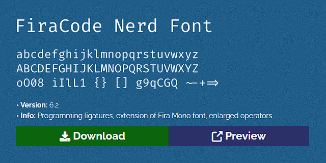
<center>Starship 에서 추천하는 FiraCode를 사용해보자.</center>

<br>

굳이 Nerd Fonts 에서 받지 않아도 된다.<br>
본인은 Mircrosoft 의 Cascadia Code PL 폰트를 사용하며 비슷한 CaskaydiaCove Nerd Font 또한 Nerd Fonts 에서 다운 받을 수 있다.

하지만 Nerd Fonts 에서 개발자들을 위한 다양한 그래픽 아이콘이 포함된 폰트를 제공하니 처음이라면 Nerd Fonts 를 추천한다.

<br>

Terminal 앱에서 폰트를 변경하기 위해서는 `Ctrl + ,`를 눌러 설정 창으로 이동 후 `기본값(혹은 원하는 프로파일) > 모양`으로 이동하여 설치한 폰트로 변경하면 된다.

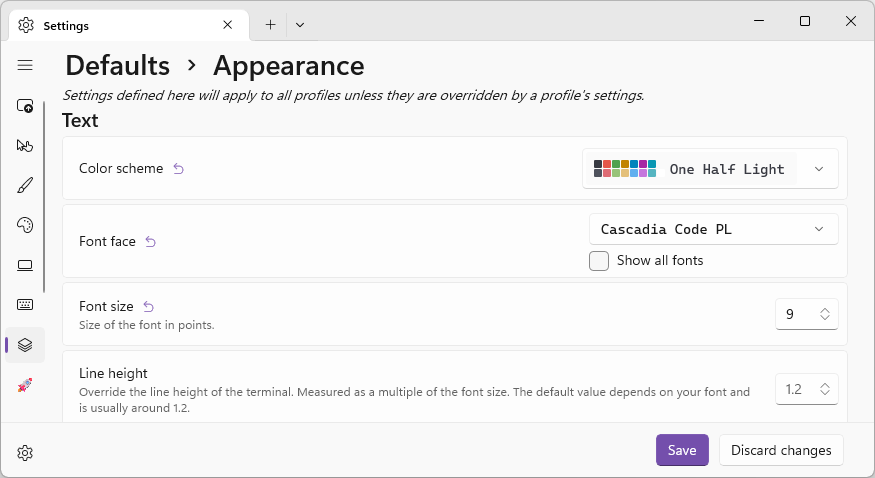

<br>

이제 [Starship Guide](https://starship.rs/guide/) 로 들어가 본인의 환경에 맞게 설치를 진행해 보자.
본 글의 설치 방법은 대부분 학생들이 사용하는 윈도우 + Bash( Git Bash )를 기준으로 한다.
( 그 외 방법또한 매우 간단하니 직접 해보며 강해지도록 하자 )

[Starship Github Release](https://github.com/starship/starship/releases)에서 최신 Starship 설치파일을 다운 받아서 설치를 진행해 준다.

<br>

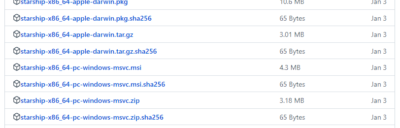
<center>Assets 를 펼치면 64bit pc Windows를 위한 starship-x86_64-pc-windows-msvc.msi 를 찾을 수 있을 것이다.</center>

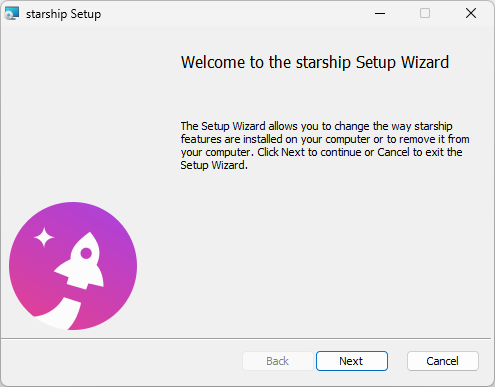
<center>설치 과정에 특별한 설정은 필요 없으니 모두 Next를 눌러 설치를 완료하도록 하자.</center>

<br>

다음으로는 사용 중인 Shell 에서 설치된 Starship을 사용할 수 있도록 rc파일을 찾아야한다.<br>
사용자 폴더를 찾아 들어가 직접 수정해도 좋지만 개발자이니 만큼 터미널로 해결해보자

Shell 의 rc 파일은 설정 파일로 `.bashrc` `.zshrc`와 같은 이름을 가지지만 윈도우에 설치된 Git Bash는 보통 `.bash_profile`이라는 이름으로 저장된다.

<br>

터미널을 열고 아래와 같이 입력하여 notepad 혹은 code 로 파일을 열어보자.
```bash
notepad ~/.bash_profile # 메모장
code ~/.bash_profile    # VSCode

notepad ~/.bashrc       # .bash_profile 이 없을 경우 시도해보자
```

bash 기준 아래와 같이 최 하단에 추가해준다.
```
# generated by Git for Windows
test -f ~/.profile && . ~/.profile
test -f ~/.bashrc && . ~/.bashrc

# 아래 starship init 설정 라인을 추가한다.
eval "$(starship init bash)"
```

<br>

그런 다음 다시 Git Bash 를 터미널로 열어보면?<br>
짜잔 Starship Prompt 로 출력되는 Git Bash 를 확인할 수 있다.

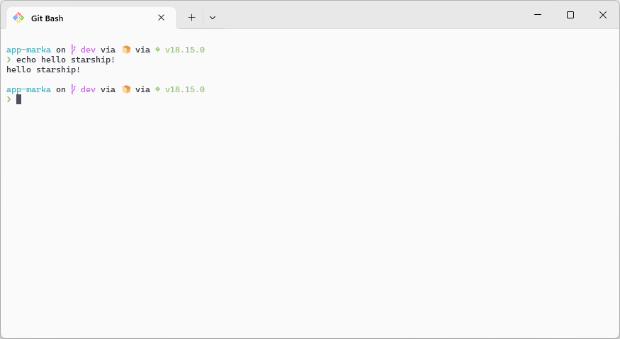

<br>

### 커스터마이징
---
하지만 기본 테마로는 뭔가 아쉽다.
아래와 같이 귀여운 테마를 적용하려면 어떻게 해야할까?

`~/.config/starship.toml`파일을 만들어 설정을 직접 추가해도 좋고
다른 사람이 만든 커스터마이징 설정을 가져다 사용해도 좋다.

<br>

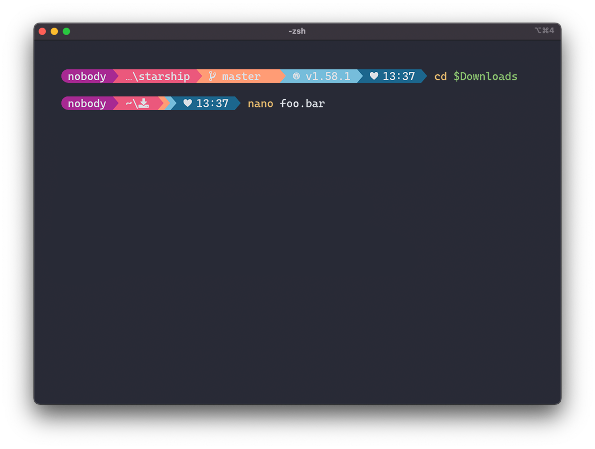
<center>Starship Guide 에서 제공하는 Pastel Powerline Preset</center>

<br>

아래 preset 명령어를 터미널에 입력하면 알아서 다운받아 적용해준다.
연습 삼아 시도해보자.
```bash
starship preset pastel-powerline -o ~/.config/starship.toml
```

<br>

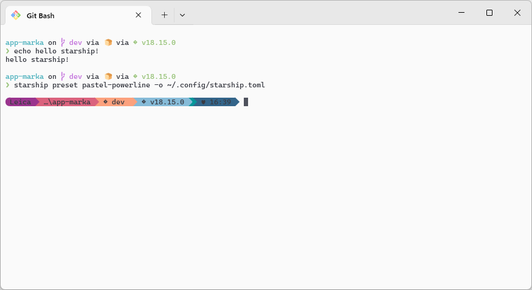

<br>

입력 후 바로 변경되는 모습을 확인할 수 있다.<br>
본인은 너무 많은 정보가 한번에 들어오는 것을 싫어하기에 개인적으로 설정을 만들었다.

아래 설정 파일을 공유할테니 마음에 드는 사람들은 편히 사용해주시길 바란다.

```toml
format = """
[](#444444)\
$os\
$username\
[](fg:#444444 bg:#ff8b93)\
$directory\
[](fg:#ff8b93 bg:#e3e5e6)\
$git_branch\
$git_status\
[](fg:#e3e5e6 bg:#00000000)\
$c\
$java\
$nodejs\
"""

[username]
show_always = true
style_user = "#ffffff bg:#444444"
style_root = "#ffffff bg:#444444"
format = '[$user ]($style)'
disabled = false

[os]
style = "#ffffff bg:#444444"
disabled = true

[directory]
style = "#000000 bg:#ff8b93"
format = "[ $path ]($style)"
truncation_length = 3
truncation_symbol = "…/"

[git_branch]
symbol = "📎"
style = "#000000 bg:#e3e5e6"
format = '[ $symbol $branch ]($style)'

[git_status]
style = "#000000 bg:#e3e5e6"
format = '[$all_status$ahead_behind ]($style)'

[java]
symbol = "☕"
format = '[ $symbol ($version) ]($style)'

[nodejs]
symbol = "✨"
format = '[ $symbol ($version) ]($style)'
```

<br>

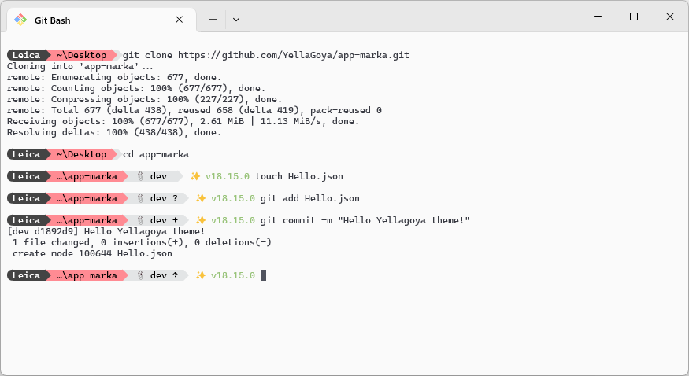

<br>

### + Windows Terminal 프로파일 아이콘 변경
---
Windows Terminal 앱에서 `Ctrl + Shift + ,`를 눌러 settings.json 파일을 열고
프로파일의 icon, name 을 원하는 아이콘 파일, 이름으로 변경해주면 정말 나만의 터미널이 완성된다.

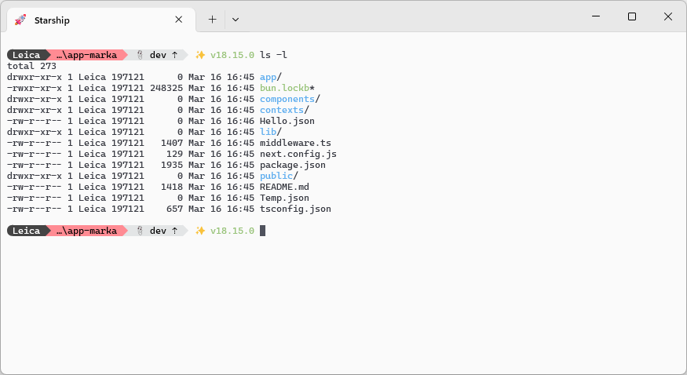

<br>

### 마치며
---
다음에는 git 명령어 관련 내용을 알기 쉽게 정리해서 가져오도록 하겠다.