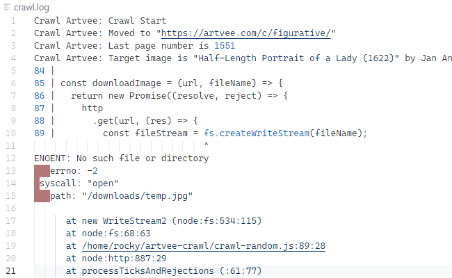
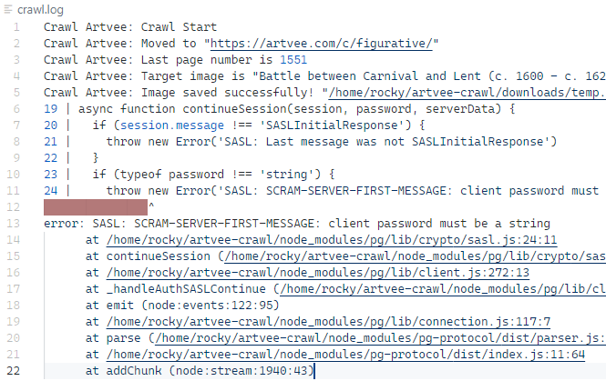

### 인트로
---
> 디버깅(영어: debugging) 또는 디버그(영어: debug)는 컴퓨터 프로그램 개발 단계 중에 발생하는 시스템의 논리적인 오류나 비정상적 연산(버그)을 찾아내고 수정하는 작업 과정이다. 일반적으로 디버깅을 하는 방법으로 체크를 통한 테스트, 기계를 사용하는 테스트, 실제 데이터를 사용해 테스트하는 법이 있다.
> 

사이드 프로젝트 Polors에 필요한 크롤링을 JS로 작성하고 자동화하기 위해 Cron을 사용하던 중 난관에 봉착했다.

터미널에서는 잘만 실행되던 코드들이 **Cron에서는 고장 나는 것.**<br/>
Cron은 실행 및 종료에 대한 로그만 남기기에 디버깅하기가 곤란했다.

내가 찾은 방법은 **직접 로그를 남겨 해결하는 것이다.**<br/>
디버깅은 언제나 어렵지만 초보의 입장에서 쉬운 방법을 소개하기 위해 글로 남긴다.

<br/>

### 로그를 어떻게?

---

기존 Crontab에 작성한 명령문은 아래와 같다.<br/>
테스트를 위해 1분마다 실행되게 하였다.<br/>
( Crontab 작성법은 알고 있다는 전제하에 작성하지 않는다. )

```bash
* * * * * ~/.bun/bin/bun ~/artvee-crawl/crawl-random.js
```

문제는 터미널 환경에서는 크롤링된 데이터가 제대로 DB에 넘어가지만 <br/>
Cron 환경에서는 DB에 아무런 변화가 없었다.

애초에 크롤링 과정에 문제가 있는것인지, DB 기록에 문제가 있는 것인지 파악조차 안되는 상황.

```bash
sudo grep bun /var/log/cron

>>> May 12 11:51:01 ... (~/.bun/bin/bun ~/artvee-crawl/crawl-random.js)
    May 12 11:52:01 ... (~/.bun/bin/bun ~/artvee-crawl/crawl-random.js)
    May 12 11:53:01 ... (~/.bun/bin/bun ~/artvee-crawl/crawl-random.js)
    May 12 11:54:01 ... (~/.bun/bin/bun ~/artvee-crawl/crawl-random.js)
```

위와 같이 실행되었다는 로그만이 보일 뿐이였다.

그래서 **표준 출력을 리다이렉션하면 되지 않을까?** 라는 생각을 하게 되었다.<br/>
런타임에 에러가 났다면 표준 출력이 발생했을 것이고 그 것을 확인할 수만 있다면 해결할 수 있었다.

그렇게 Crontab 명령문을 아래와 같이 수정하였다.

```bash
* * * * * ~/.bun/bin/bun ~/artvee-crawl/crawl-random.js >> ~/artvee-crawl/crawl.log 2>&1
```

<br/>

`>> ~/artvee-crawl/crawl.log 2>&1` 이 부분을 하나씩 알아보자.

- `>>` 는 표준 출력 리다이렉션을 의미한다.

  그리고 뒤에 붙은 파일명은 리다이렉션이 향하는 파일.<br/>
  기록될 로그 파일을 의미한다.

- `2>&1` 은 표준 에러를 표준 출력으로 리다이렉션한다.

  표준 에러는 별도로 리다이렉션 되지 않기에 이와 같이 포함시켜야 한다.

<br/>



<center>짜잔. 그리운 에러 코드가 로그로 남아있다.</center>

첫 번째 문제점을 찾을 수 있었다.<br/>
<U>>> ENOENT: No such file or directory</U>

**Cron 환경에서는 상대 경로가 제대로 작동하지 않을 수 있다.**<br/>
해당 경로는 `__dirname` + 파일명 조합으로 fileName 변수 값을 수정하여 해결.

<br/>



<br/>

두 번째 문제점 또한 바로 확인할 수 있었다.<br/>
<U>>> error: SASL: SCRAM-SERVER-FIRST-MESSAGE: client password must be a string</U>

이 또한 Cron의 경로 문제로 발생하였던 것이다.
아래와 같이 PostgreSQL 연결 파일에 dotenv 설정 path를 바꿔서 해결.
```jsx
import dotenv from 'dotenv';
dotenv.config({ path: __dirname + '/.env' });

...
```

<br/>

### 마치며

---

순간 막막했지만 기존 리눅스 서버 모니터링을 위해 표준 출력을 로그화했던 경험을 토대로 해결할 수 있었다.

답답하더라도 천천히 길을 찾고자 하면 해결 방안이 떠오를 것이다.<br/>
**트러블슈팅을 통해 경험은 실력으로 Stack 된다.**