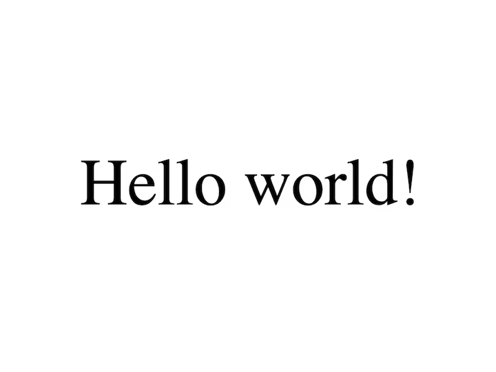

### 블로그 시작
--- 
블로그를 시작하기로 했다. 사실 그렇게 거창한 이유가 있다거나 하지는 않다. 

백엔드에서 프론트로 내 개발 방향을 바꾸고 나니 걱정이 하나 생겼기 때문이다. 앞으로 내가 무엇을 보여 주어야 할지가 걱정되었다. SSAFY에서 진행한 프로젝트가 몇 가지 있지만 따로 배포하거나 하지 않았으니 말이다.

딥러닝 모델을 사용하거나 백엔드에서 해야 할 일이 많아 서버가 없다면 제대로 작동하지 않을 프론트를 보여줘야 하니 말이다. 그렇게 고민하다가 블로그를 시작하려 여러 방법을 찾아보았다.  

### Gatsby?
---
여러 가지 블로그 플랫폼이 있다. 
`티스토리` `워드프레스` `벨로그` 등 다양한 플랫폼이 있지만 어느 하나도 마음에 쏙 들지는 않았다. 간편한 기능을 통해 블로그를 만들 수 있어도 간편함 / 자유로움 이 반비례하는 덕에 제한이 꼭 있었다. 

그렇게 찾다 보니 github 블로그가 있지 않은가? 
github 블로그는 직접 개발해야 하는 블로그이다. ( 물론 템플릿을 써도 된다. 하지만 블로그마저 다른 이의 힘을 빌려 만드는 것은 자존심이 허락하지 않았다. ) 이 github.io 로 끝나는 블로그들의 프레임워크도 여러 가지가 있다.

(https://www.reddit.com/r/webdev/comments/b0j9rs/infographic_gatsby_vs_hugo_vs_jekyll/)

Ruby, Go, JavaScript 3가지 언어 선택이 가능한데... 당연히 내가 프론트로 노선을 바꾼 후 배운 것이라고는 JS뿐인 React라니 완벽했다. 나에게는 Gatsby의 압승이다. 거기에 다양한 플러그인이 있으니 싱글벙글 웃음마저 나온다.  

### 템플릿
---

(https://github.com/christiandavid/gatsby-theme-byfolio)

보는 바와 같이 Gatsby에도 다양한 테마 템플릿이 존재한다. 하지만 나는 결심했다. 진정한 프론트 개발자가 되어 보기로. 모든 것을 부딪쳐 가며 직접 배워보고 싶었다.

(https://www.gatsbyjs.com/starters/gatsbyjs/gatsby-starter-hello-world)

Gatsby에서 제공하는 `Hello world!` 테마는 정말 실행했을 때 'Hello world!' 외에는 아무것도 없다. 이 얼마나 깔끔한 템플릿이란 말인가.. 아마 내가 이때 다른 화려한 템플릿을 선택했더라면 지금만큼 Gatsby를 잘 활용하지는 못했을 것 같다. Gatsby 모든 것들을 처음부터 직접 써 내려갔으니 더욱 많은 것들이 남았다.  

### 마치며
---
다음 글 에서는 Gatsby를 활용하여 첫 페이지를 만드는 법을 알아본다.