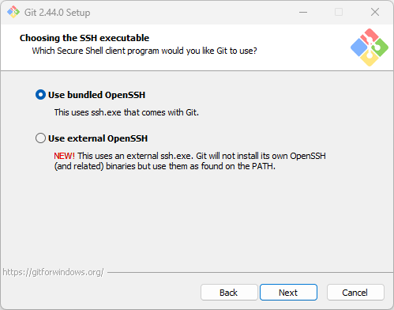

### 인트로
---
처음 코딩에 입문하는자의 os는 윈도우, 터미널은 cmd를 사용하게 된다.
리눅스 맛을 살짝 첨가한 git에서 지원하는 Bash shell을 윈도우에서, 윈도우의 최신 터미널 어플리케이션 Terminal과 함께 사용해보자.

한번 사용하게 되면 빠져나올 수 없는 Bash shell 왜 그런 것 일까?

<br>

### CMD vs Bash shell
---
CMD(Command Prompt)와 Bash Shell은 사용자가 컴퓨터와 상호작용하는 방식에 있어서 기본적으로 서로 다른 접근 방식과 기능을 제공한다. 이 두 인터페이스의 주요 차이점을 살펴보자.

<br>

##### CMD의 인터페이스 특징
CMD는 윈도우 운영 체제의 기본 명령줄 인터페이스로, 복잡하지 않은 시스템 관리 작업과 파일 작업 등을 수행하는 데 사용한다. 이는 윈도우 사용자에게 친숙한 환경을 제공하며, 주로 단일 명령 실행에 초점을 맞춘다.

- 시스템 관리 및 파일 작업을 위한 기본적인 명령어 제공
- 단순한 스크립팅이 가능하나 복잡한 로직 구현에는 제한적
- GUI 환경과 긴밀하게 통합되어 있지 않음

##### Bash Shell의 특징
Bash는 유닉스/리눅스 시스템에서 널리 사용되는 Shell이며, 복잡한 스크립팅과 프로그래밍을 지원하는 고급 기능을 제공한다. Bash는 유연성과 확장성이 뛰어나며, 시스템 관리 및 프로그래밍 작업에 널리 사용된다.

- 고급 스크립팅 기능 및 프로그래밍 구조(조건문, 반복문 등) 지원
- 명령줄에서 직접 텍스트 편집을 가능하게 하는 명령라인 편집 기능
- 여러 유닉스/리눅스 기반 도구 및 프로그램과의 호환성 및 통합

<br>

위 특징을 비교해보았을 때 간단한 사용 목적이 아닌 개발 환경 및 Git을 더욱 활용하기위해 Git Bash를 통해 초보자가 '찍먹' 해보는게 좋겠다는 생각이다. 나중에 서버 환경에서 ssh로 터미널만 하루종일 들여다 보게된다면 분명 도움이 될 것이다.

<br>

### Git Bash 설치
---
https://git-scm.com/downloads 로 들어가 `Windows > Standalone Installer > 본인 OS 32 / 64 bit 선택`을 통해 Git 설치 파일을 다운받는다.


##### <center>설치 진행</center>


<center>Git이 설치될 디렉터리 설정</center>


<center>Terminal 앱 사용 및 GUI는 사용하지 않기에 컨텍스트 메뉴 2개는 해제 하였다.</center>
<center>(Windows Explorer integration 이하 2개)</center>


<center>본인은 텍스트 에디터로 VSCode를 사용하도록 설정하였다. (기본 Vim 에디터)</center>
<center>아래 세부 설정은 개인 환경에 필요한 것이 아니라면 기본 선택을 따라간다.</center>





<center>View Release Notes 체크를 해제 하자. 굳이 볼 필요는 없다.</center>

위 과정을 통해 Git 설치는 완료되었다.
Git 설정에 앞서 터미널 설치 및 설정을 먼저 해주도록 하자.

<br>

### Windows Terminal 앱
---
Terminal 앱은 따로 흩어져있는 shell, interface를 한 어플리케이션을 통해 컨트롤 할 수 있게 해준다.

그 외에도 폰트 및 테마 커스터마이징에 용이하니 윈도우 환경이라면 반갑지 아니할 수 없다.

<br>


<center>(본인이 사용 중인 Terminal의 모습)</center>

<center>최근 윈도우를 설치하면 Terminal 앱이 기본적으로 설치되어 있는 것 같지만 따로 설치가 필요하다면 Microsoft Store 에서 다운로드가 가능하다.</center>


<br>

Git Bash를 Terminal 앱에 추가하기 위해서는 GUI 환경에서 설정창이 아닌 Settings.json 파일의 Profiles를 수정해주어야 한다.

Terminal 앱에서 `Ctrl + Shift + ,`를 누르거나 상단의 더보기 표시를 눌러 `설정 > 좌측 하단 톱니바퀴`버튼을 누르면 Settings.json 편집 창이 뜬다.

아래의 프로파일을 `profiles > list`에 추가해주면 Git Bash를 Terminal 앱에서 사용할 수 있다.

<br>

```json
{
    "guid": "{124fc1da-dadc-4276-9c4e-f0524ba57a49}",
    "name": "Git Bash",
    "commandline": "\"%PROGRAMFILES%\\git\\usr\\bin\\bash.exe\" -i -l",
    "icon": "%PROGRAMFILES%\\git\\mingw64\\share\\git\\git-for-windows.ico",
    "startingDirectory": "%USERPROFILE%",
    "cursorShape": "filledBox",
    "hidden": false
},
```

<center>위 프로파일 코드를 아래와 같이 추가해 주자.</center>

```json
{
    "$help": "https://aka.ms/terminal-documentation",
    "$schema": "https://aka.ms/terminal-profiles-schema",
    ...

    "profiles": 
    {
        ...

        "list": 
        [
            {
                "guid": "{124fc1da-dadc-4276-9c4e-f0524ba57a49}",
                "name": "Git Bash",
                "commandline": "\"%PROGRAMFILES%\\git\\usr\\bin\\bash.exe\" -i -l",
                "icon": "%PROGRAMFILES%\\git\\mingw64\\share\\git\\git-for-windows.ico",
                "startingDirectory": "%USERPROFILE%",
                "cursorShape": "filledBox",
                "hidden": false
            },
            {
                "commandline": "%SystemRoot%\\System32\\WindowsPowerShell\\v1.0\\powershell.exe",
                "guid": "{61c54bbd-c2c6-5271-96e7-009a87ff44bf}",
                "hidden": false,
                "name": "Windows PowerShell"
            },
            ...

        ]
    }
}
```

<br>
<br>


<center>위 수정 후 settings.json을 저장하면 Git Bash가 Terminal에 추가된 것을 볼 수 있다.</center>

<br>

### Git 설정하기
---
Git 을 설치했으니 commit, push에 사용할 인증 정보를 등록하자.

```bash
git config --global user.name "사용자이름"
git config --global user.email "이메일@example.com"
```

처음 Git을 설치한 PC에서는 추가 적인 인증 절차를 필요로 할 것이다.
Git Credential Manager를 따라 잘 인증하도록 하자.

<br>

### 자주 사용하는 Git Bash 명령어
---
##### 파일 및 디렉토리 관리 명령어
- ls: 현재 디렉토리에 있는 파일 및 폴더를 나열한다. -l 옵션을 추가하면 보다 자세한 정보를 볼 수 있다.
- cd [directory_name]: 다른 디렉토리로 이동한다. 상위 디렉토리로 가려면 cd ..를 사용한다.
- mkdir [directory_name]: 새로운 디렉토리를 생성한다. 디렉토리 구조를 만들 때 사용된다.
- rm [file_name]: 파일을 삭제한다. 디렉토리를 삭제하려면 -r 옵션을 사용해야 한다.
- touch [file_name]: 새 파일을 생성하거나, 파일의 타임스탬프를 현재 시간으로 업데이트한다.
##### 검색 및 텍스트 처리
- grep [pattern] [file]: 텍스트 파일 내에서 패턴 또는 문자열을 검색한다.
- find [directory] -name [file_name]: 특정 디렉토리 내에서 파일을 이름으로 검색한다.
- sed 's/[old_string]/[new_string]/g' [file_name]: 파일 내에서 문자열을 찾아 다른 문자열로 치환한다.
##### 시스템 및 프로세스 관리
- ps: 현재 실행 중인 프로세스 목록을 보여줍니다. -ef 옵션을 통해 보다 자세한 정보를 얻을 수 있다.
- kill [process_id]: 특정 프로세스를 종료한다. 시스템에서 문제를 일으키는 프로세스를 강제로 종료할 때 사용한다.

<br>

### 마치며
---
다음에는 본인 터미널 예시 사진과 같이 좀 더 멋있게 터미널을 꾸미는 방법을 알아보자.