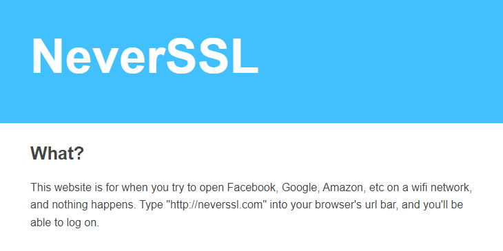

### 인트로
---
리눅스가 설치된 노트북을 들고 카페에 간다.<br>
퍼블릭 와이파이 ( 스타벅스 등 ) 에 연결하면... 짠! 아무 것도 되지 않는 경우가 많다.

처음에는 무엇이 문제인지 몰랐다.<br>
보통 퍼블릭 와이파이에 연결하면 로그인 페이지로 연결되기 때문...<br>
하지만 리눅스에서는 되지 않는 경우가 많다.<br><br>
그렇다면 우리는 어떻게 해결해야 할까?

### neverssl.com
---
> A **captive portal** is a web page accessed with a [web browser](https://en.wikipedia.org/wiki/Web_browser "Web browser") that is displayed to newly connected users of a [Wi-Fi](https://en.wikipedia.org/wiki/Wi-Fi "Wi-Fi") or wired network before they are granted broader access to network resources.

출처: 위키피디아

위 설명을 읽어보면 `캡티브 포털` 은 와이파이 혹은 네트워크에 처음 연결된 유저를<br>
접속 권한을 주기 전 납치하는 웹 페이지로의 이동을 의미한다.

" 너 로그인 안했잖아. "

라며 로그인 혹은 권한을 얻기 위한 페이지로 이동( 리다이렉트 ) 시키는 것.

하지만 우리가 브라우저를 열고 접속하는 거의 모든 웹 사이트들은 HTTPS를 사용하며 보안을 위해 리다이렉트를 허용하지 않는다.<br>
그렇기에 리다이렉트가 가능한 HTTP 웹 사이트로 접속하면 바로 와이파이 로그인 페이지로 납치가 되고 우리는 퍼블릭 와이파이 이용이 가능해진다.

이런 목적으로 만들어진 웹 사이트가 `neverssl.com` 이다.



neverssl.com 은 이름 그대로 SSL( HTTPS )을 사용하지 않는다.<br>
캡티브 포털의 로그인 페이지를 안전하게 띄울 수 있는 것이다.

### Network Manager
---
리눅스는 서버 환경 사용 목적으로 사용하는 os 이기에 이런 캡티브 포털에 대한 고려를 하지 않았다.

보통 윈도우나 맥os 에서는 퍼블릭 와이파이를 연결한 순간 바로 캡티브 포털이 뜨지만<br>
우리의 리눅스 님은 그런 것 신경쓰지 않는다는 것.

그렇다면 방법이 없는 것일까?

Rocky Linux 기준 `/etc/NetworkManager/NetworkManager.conf` 를 에디터로 열고 아래와 같이 추가해주자.

```
[connectivity]
.uri=http://connectivity-check.ubuntu.com
```

Network Manager 가 네트워크 상태를 주기적으로 확인하고 캡티브 포털을 감지할 수 있게된다.
### 마치며
---
다음에는 더 쓸만한 리눅스 잡 지식을 가져오도록 하겠다.