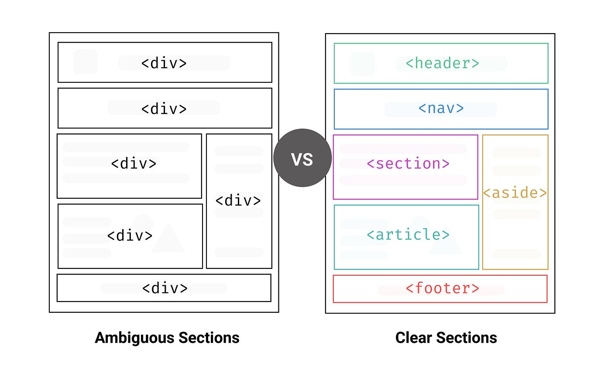

# 시멘틱 마크업

생성일: August 31, 2023 5:20 PM
카테고리: 컨셉
태그: html, markup language, semantic

### 인트로

평소 html을 작성할 때 div를 난무하지 말라는 말을 많이 들었다. 바로 옆 친구의 12단 div를 보고 왜 하지 말라는 것인지 이해했다. 그럼 div를 적게 쓰는 것보다 더 가시 성이 뛰어난 방법은 무엇일까? 다른 친구가 시멘틱 마크업에 대해 알려주었다. 한번 알아보자.

### HTML Semantic Markup

> **[semantic](https://en.dict.naver.com/#/entry/enko/74453940307f4c45ba76b0aa988fc5c3)**
미국∙영국*[sɪˈmæntɪk]*
> 
> 
> **형용사**
> : 의미의, 의미론적인
> 



의미론적인? 단어만 보았을 때는 바로 이해가 되지 않는다. 하지만 바로 위 그림의 우측 예를 보았다면 각 태그가 의미하는 뜻 그대로 각 부분을 구성 하는 것이라고 이해할 수 있을 것이다.

머릿말 `<header>` , 네비게이션 `<nav>` , 메인 컨텐츠 `<main>` 그리고 그 안에 나누어진 `<section>` `<article>` 이 들어가며 메인 컨텐츠와 간접적으로 연관된 부분을 `<aside>` 로 나타낸다. 당연히 최하단은 `<footer>` .

`<section>` `<article>` 은 헷갈리기 쉬운데 `<section>` 은 서로 연관되어 있지만 나누어야 할 때, `<article>` 은 서로 관계없이 독자적으로 서로 구분할 때 사용한다고 이해했다.

```html
<section>
  ref.
	<article>논문 1</article>
  <article>논문 2</article>
</section>

<article>
	작성자 프로필
	<section>정보</section>
	<section>연락처</section>
	<section>작성글</section>
</article>
```